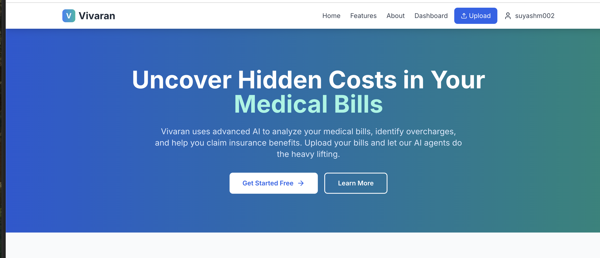
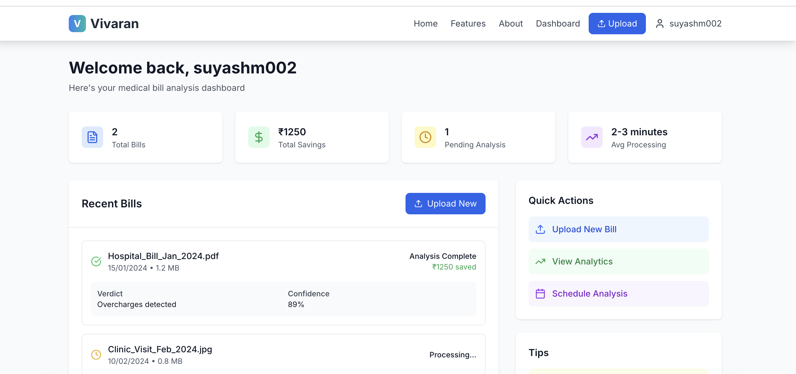
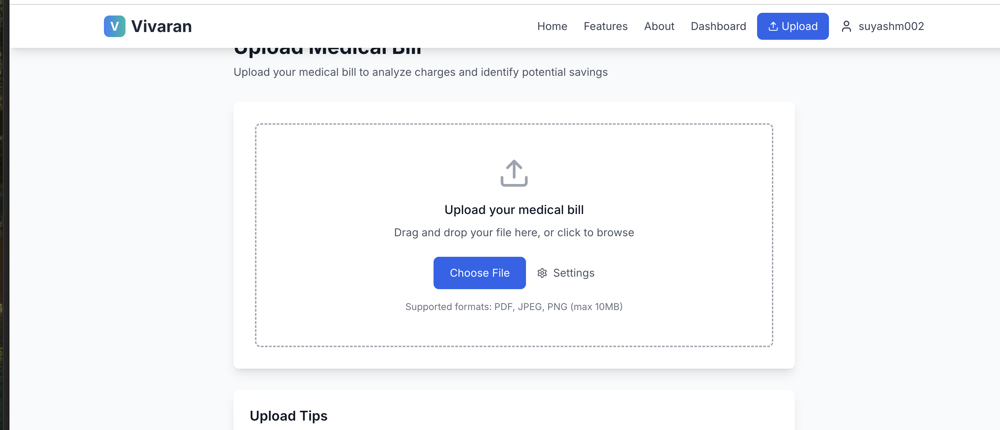

# Vivaran - AI-Powered Medical Bill Analysis

Vivaran is a React-based web application that helps users analyze medical bills using AI to identify hidden costs and optimize insurance claims. Built with modern web technologies and designed for both desktop and mobile devices.

## Screenshots

### Dashboard


### Features Overview


### File Upload Interface


## Features

- **AI-Powered Analysis**: Upload medical bills and get detailed analysis using the VivaranAI API
- **Overcharge Detection**: Identify potential overcharges and billing errors
- **Insurance Optimization**: Get recommendations for insurance claim optimization
- **Responsive Design**: Works seamlessly on desktop, tablet, and mobile devices
- **File Upload**: Support for PDF, JPEG, and PNG formats
- **Real-time Processing**: Get analysis results in 2-3 minutes
- **Secure Authentication**: Firebase-based user authentication
- **Health Tech UI**: Modern, health-focused user interface

## Technology Stack

- **Frontend**: React 19 with TypeScript
- **Build Tool**: Vite
- **Styling**: Tailwind CSS
- **Authentication**: Firebase Auth
- **Icons**: Lucide React
- **Routing**: React Router DOM
- **API**: VivaranAI Analysis API

## Getting Started

### Prerequisites

- Node.js 18 or higher
- npm or yarn
- Firebase project (for authentication)

### Installation

1. Clone the repository:
```bash
git clone https://github.com/suyash-frozo/vivaranApp.git
cd vivaranApp
```

2. Install dependencies:
```bash
npm install
```

3. Set up environment variables:
```bash
cp .env.example .env
```

4. Configure Firebase:
   - Create a Firebase project at https://console.firebase.google.com
   - Enable Authentication with Email/Password
   - Copy your Firebase config to the .env file

### Running the Application

1. Start the development server:
```bash
npm run dev
```

2. Open your browser and navigate to `http://localhost:3000`

### Building for Production

```bash
npm run build
```

The built files will be in the `dist` directory.

## Project Structure

```
src/
├── components/          # Reusable UI components
│   ├── Navbar.tsx
│   └── ProtectedRoute.tsx
├── contexts/           # React contexts
│   └── AuthContext.tsx
├── pages/              # Page components
│   ├── DashboardPage.tsx
│   ├── LandingPage.tsx
│   ├── LoginPage.tsx
│   ├── SignupPage.tsx
│   └── UploadPage.tsx
├── services/           # API services
│   ├── firebase.ts
│   └── vivaranApi.ts
├── types/              # TypeScript type definitions
│   └── index.ts
├── utils/              # Utility functions
│   └── fileUtils.ts
├── App.tsx
├── main.tsx
└── index.css
```

## API Integration

The application integrates with the VivaranAI API for medical bill analysis:

- **Endpoint**: `https://endearing-prosperity-production.up.railway.app/analyze`
- **Method**: POST
- **Supported Formats**: PDF, JPEG, PNG
- **Max File Size**: 10MB

### API Request Format

```json
{
  "file_content": "base64_encoded_content",
  "doc_id": "unique_document_identifier",
  "user_id": "user_identifier",
  "language": "english",
  "state_code": "state_abbreviation",
  "insurance_type": "insurance_category",
  "file_format": "pdf"
}
```

## Features in Detail

### Authentication
- Email/password authentication via Firebase
- Protected routes for authenticated users
- User profile management

### File Upload
- Drag and drop file upload
- File validation (type, size)
- Progress indication during upload
- Analysis settings (language, state, insurance type)

### Dashboard
- Overview of uploaded bills
- Analysis results and savings
- Quick actions and tips
- Statistics and analytics

### Responsive Design
- Mobile-first approach
- Optimized for iOS and Android devices
- Touch-friendly interface
- Responsive navigation

## Environment Variables

```bash
# Firebase Configuration
REACT_APP_FIREBASE_API_KEY=your_firebase_api_key
REACT_APP_FIREBASE_AUTH_DOMAIN=your_project_id.firebaseapp.com
REACT_APP_FIREBASE_PROJECT_ID=your_project_id
REACT_APP_FIREBASE_STORAGE_BUCKET=your_project_id.appspot.com
REACT_APP_FIREBASE_MESSAGING_SENDER_ID=your_messaging_sender_id
REACT_APP_FIREBASE_APP_ID=your_app_id

# API Configuration
REACT_APP_API_ENDPOINT=https://endearing-prosperity-production.up.railway.app/analyze
```

## Contributing

1. Fork the repository
2. Create your feature branch (`git checkout -b feature/amazing-feature`)
3. Commit your changes (`git commit -m 'Add some amazing feature'`)
4. Push to the branch (`git push origin feature/amazing-feature`)
5. Open a Pull Request

## License

This project is licensed under the ISC License.

## Support

For support, please contact the development team or create an issue in the GitHub repository.

---

**Note**: This is a health tech application that processes medical bills. Ensure you comply with all relevant healthcare data privacy regulations (HIPAA, etc.) when deploying to production.